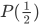
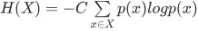
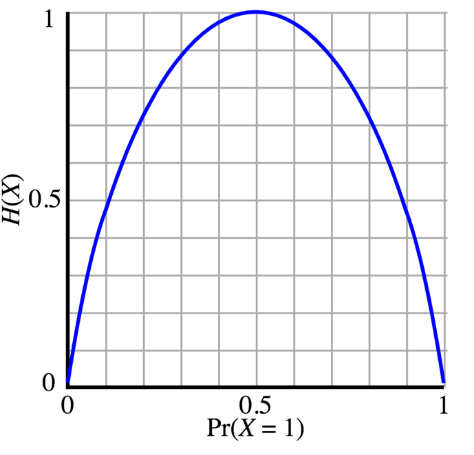

# 04_信息的量化度量：世界上有稳赚不赔的生意吗？

## 怎样去衡量信息的大小？

1. 之前的人会尝试以衡量信息量**重要性**来度量信息

> 但重要性的衡量似乎太主观了，这就像问你人生的意义是什么？——人生最重要的是啥？每个人都不一样。

2. 香浓找到了这个度量衡——比特

- 比特：如果一个黑盒子中有两种可能性，它们出现的概率相同，那么要搞清楚到底是 A 还是 B，所需要的信息量就是一比特

> 一比特  ≈ 可以使的信息确定
>
> $P(\frac {1} {2})$

3. Notion

- 信息源——我们把这样充满不确定性的黑盒子
- 信息熵——里面的不确定性
- 信息——就是用来**消除**这些**不确定性**的（信息熵）
- 信息量——搞清楚黑盒子里是怎么一回事所消耗的信息，等于黑盒子里的“信息熵”。

> 信息熵的公式：$$H(X) = -C \sum \limits_{x \in X}  p(x) log p(x)$$

4. 永远不要听那些正确率总是 50% 的专家的建议，因为那相当于什么都没说，没有提供能够减少“信息熵”的“信息量”

